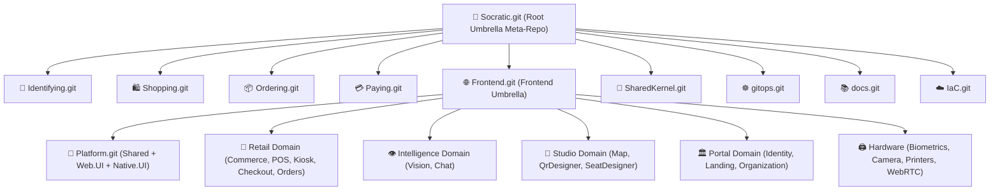

# Socratic Federated Meta-Repository & Git Submodules Workflow

## 1. 🏛️ Architectural Pattern: Federated Meta-Repository & Stream-Aligned Teams

Socratic uses the **Federated Meta-Repository Pattern** (also known as *Umbrella Repository* with *Stream-Aligned Teams* from Team Topologies and *Self-Contained Systems (SCS)*).

### Key Architectural Tenet:
> **Maximum Team Autonomy with Unified Ecosystem Orchestration:**
> A new engineer joining a stream-aligned team (e.g., Retail/Commerce, Retail/POS, Retail/Kiosk, or Intelligence/Vision) does **NOT** clone the entire umbrella repository. They clone **only their feature repository** (`git clone --recurse-submodules https://github.com/socratic-uz/<Feature>.git`) and immediately get a fully functional, self-contained development environment with its own submodules, host, and launch profiles.
> Simultaneously, the root `Socratic` meta-repository orchestrates all microservices, frontend features, and infrastructure as a unified whole.

---

## 2. 🗺️ Multi-Tier Repository Topology



### Complete Submodule Registry:

| Tier | Submodule Path (Frontend Meta-Repo) | Remote Repository | Domain / Ownership |
|---|---|---|---|
| **Root** | `src/Frontend` | `https://github.com/socratic-uz/Frontend.git` | Frontend Umbrella Meta-Repo |
| **Platform** | `Platform` | `https://github.com/socratic-uz/Platform.git` | Shared, DesignSystem (Material.Web/Smart.Web), Web.UI, Native.UI |
| **Retail** | `Retail/Commerce` | `https://github.com/socratic-uz/Commerce.git` | 28 Universal Product UX Modes & Catalog |
| **Retail** | `Retail/POS` | `https://github.com/socratic-uz/POS.git` | Cashier Terminal & Barcode Operations |
| **Retail** | `Retail/Kiosk` | `https://github.com/socratic-uz/Kiosk.git` | Self-Service Kiosks & Customer Flow |
| **Retail** | `Retail/Checkout` | `https://github.com/socratic-uz/Checkout.git` | Fast-Checkout, Carts & Drawer |
| **Retail** | `Retail/Orders` | `https://github.com/socratic-uz/Orders.git` | Order Management & History |
| **Intelligence** | `Intelligence/Vision` | `https://github.com/socratic-uz/Vision.git` | YOLOv10, Biometrics & FaceID |
| **Intelligence** | `Intelligence/Chat` | `https://github.com/socratic-uz/Chat.git` | AI Concierge, gRPC Chat Client |
| **Portal** | `Portal/Identity` | `https://github.com/socratic-uz/Identity.git` | Auth, Passkeys, Profiles, Security |
| **Portal** | `Portal/Landing` | `https://github.com/socratic-uz/Landing.git` | Public Landing & Showcase Pages |
| **Portal** | `Portal/Organization` | `https://github.com/socratic-uz/Organization.git` | Multi-Tenant Organizations & Settings |
| **Studio** | `Studio/Map` | `https://github.com/socratic-uz/Map.git` | Interactive Venue & Seating Maps |
| **Studio** | `Studio/QrDesigner` | `https://github.com/socratic-uz/QrDesigner.git` | QR Code Design & Print Studio |
| **Studio** | `Studio/SeatDesigner` | `https://github.com/socratic-uz/SeatDesigner.git` | Table & Seat Layout Editor |
| **Hardware** | `Hardware` | Local Platform Module | ESC/POS, Scales, Scanners, WebRTC |
| **Shared** | `src/Shared/SharedKernel` | `https://github.com/socratic-uz/SharedKernel.git` | gRPC Protos, SmartEnums, ValueObjects |

---

## 3. ⚙️ Standard Build Configurations (Strict Standard)

All `.csproj` files, `Directory.Build.props`, and `.slnx` solution files in the entire ecosystem define the **5 standardized configurations**:

```xml
<Configurations>Debug;Release;LocalDebug;Runner;Cluster</Configurations>
```

| Configuration | Intent / Target Environment | Optimization & Constants |
|---|---|---|
| `Debug` | Standard local development with full debug symbols and local services | Optimization off, `DEBUG;TRACE` |
| `Release` | Production build optimized for deployment, AOT and trimming | Optimization on, symbols stripped |
| `LocalDebug` | Local debugging against standalone mock backend or local containers | Custom local endpoints, mock auth |
| `Runner` | CI/CD test runners, automated smoke tests and benchmark executions | Deterministic build, headless mode |
| `Cluster` | Containerized in-cluster deployment (Kubernetes / Aspire Service Discovery) | OTLP telemetry enabled, DNS resolution |

---

## 4. 🧠 Dual-Mode Build System (Standalone vs Monorepo)

Every feature module operates under the **Dual-Mode Discovery Pattern**:

1. **Standalone Mode** (Feature Developer):
   - Developer clones: `git clone --recurse-submodules https://github.com/socratic-uz/Commerce.git`
   - `Directory.Build.props` in the feature root imports local properties and fallback packages.
   - Solution uses the local standalone host (`Platform/Web.UI`) to run the feature in total isolation.

2. **Monorepo Mode** (Umbrella Developer / Architect):
   - Developer opens `Frontend.slnx` or `Socratic.slnx`.
   - Root `Directory.Build.props` sets `<_SocraticRootProps>true</_SocraticRootProps>`.
   - Sub-features inherit root packages, centralized analyzers, and Aspire orchestration.

---

## 5. 🚀 Developer Workflows & Submodule Initialization

### ⚠️ Critical Rule: Zero Nested Duplication in Umbrella Repositories
Inside the `Frontend` and `Socratic` meta-repositories, all shared dependencies are already unified:
- `src/Shared/SharedKernel` — Shared gRPC contracts, Protobuf, and DTOs.
- `src/Frontend/Platform/Shared` — Domain, Infrastructure, Composition, DesignSystem (Material.Web, Smart.Web).
- `src/Frontend/Hardware` — Hardware drivers (printers, cameras, scales).
- `src/Frontend/Platform/Web.UI` — Universal Blazor host.

> [!CAUTION]
> **Never recursively clone or initialize nested submodules inside the umbrella repository!**
> If nested submodules are initialized inside features, type ambiguity and duplicate compilation errors will occur.

---

## 6. 🌳 Multi-Tier Git Commit Workflow

> [!IMPORTANT]
> **DO NOT automatically commit or push to Git** without explicit user instruction.
> When instructed to commit, always commit in **bottom-up order** through the hierarchy.

### Commit Sequence (Bottom-Up):
1. **Tier 1 (Platform, Hardware & Shared Kernel)**:
   ```bash
   # Example: Platform
   git -C src/Frontend/Platform status
   git -C src/Frontend/Platform add .
   git -C src/Frontend/Platform commit -m "<type>(platform): <message>"
   git -C src/Frontend/Platform push origin HEAD
   ```

2. **Tier 2 (Stream-Aligned Feature Repositories)**:
   ```bash
   # Example: Retail/Commerce
   git -C src/Frontend/Retail/Commerce status
   git -C src/Frontend/Retail/Commerce add .
   git -C src/Frontend/Retail/Commerce commit -m "feat(commerce): <message>"
   git -C src/Frontend/Retail/Commerce push origin HEAD
   ```

3. **Tier 3 (Frontend Umbrella Meta-Repo)**:
   ```bash
   git -C src/Frontend status
   git -C src/Frontend add .
   git -C src/Frontend commit -m "chore(features): update submodule pointers"
   git -C src/Frontend push origin HEAD
   ```

4. **Tier 4 (Root Umbrella Meta-Repo)**:
   ```bash
   git status
   git add src/Frontend src/Backend/*
   git commit -m "chore(ecosystem): synchronize submodule pointers"
   git push origin HEAD
   ```

---

## 7. 🔄 Submodule Synchronization Commands

- **Обновить субмодули верхнего уровня**:
  ```bash
  git submodule update --remote --merge
  git -C src/Frontend submodule update --remote --merge
  ```
- **Проверить статус только активных субмодулей**:
  ```bash
  git submodule foreach --recursive "git status -s"
  ```
