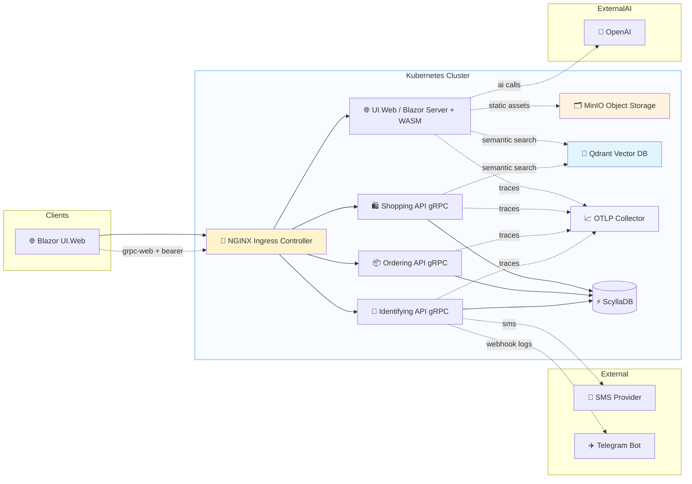
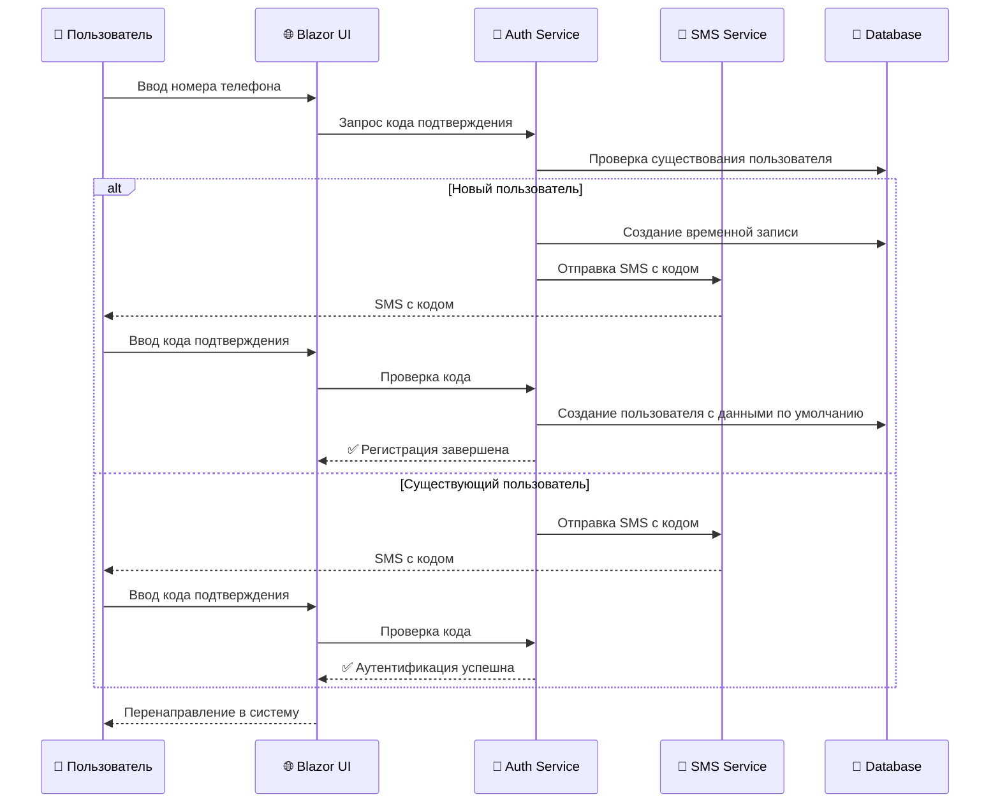
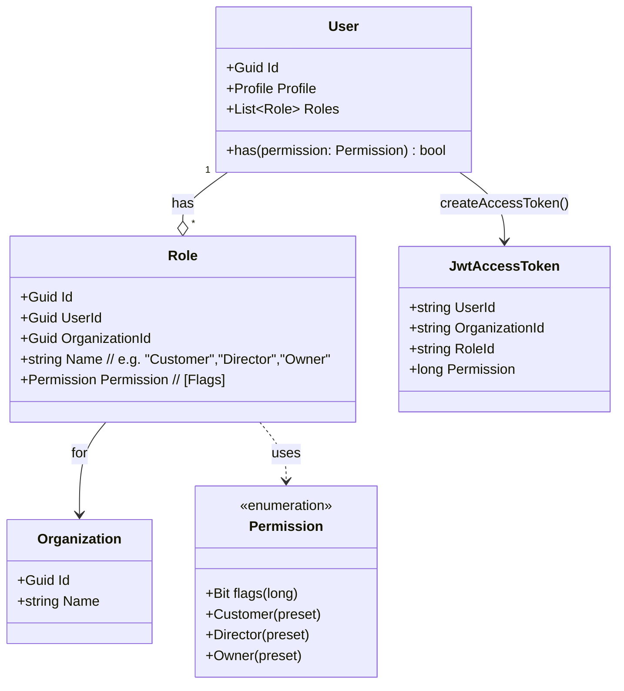
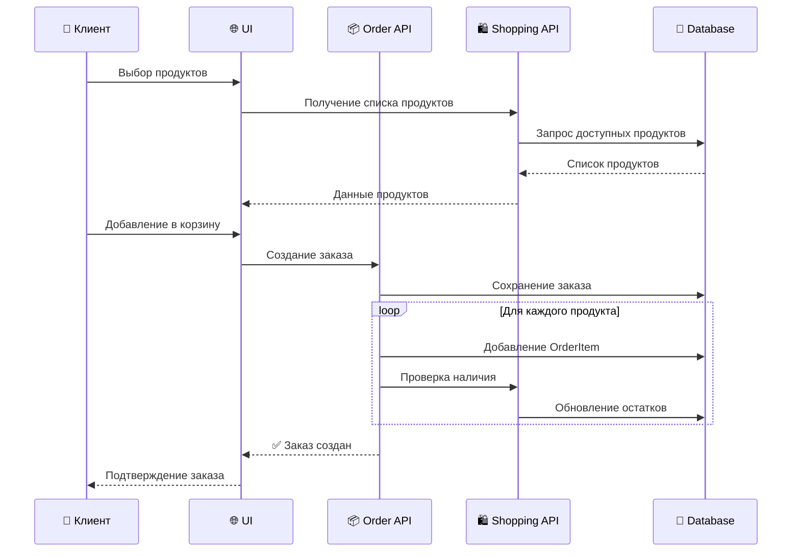
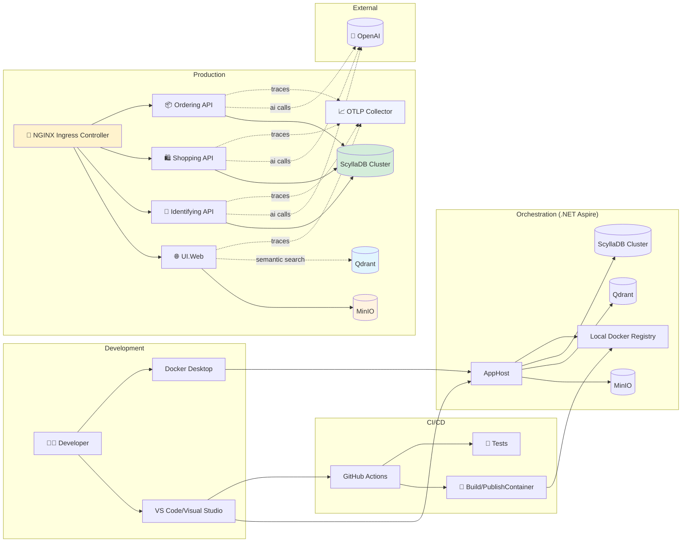
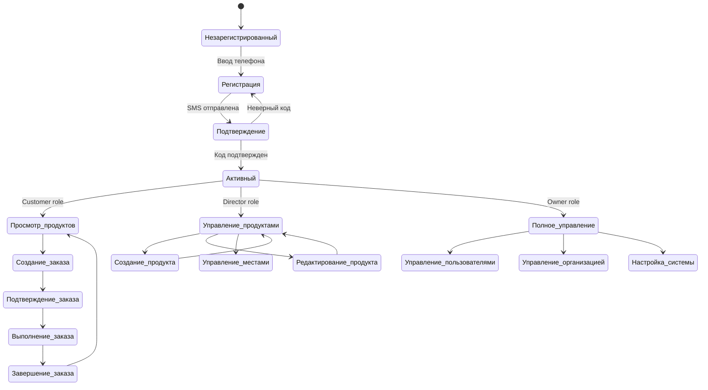
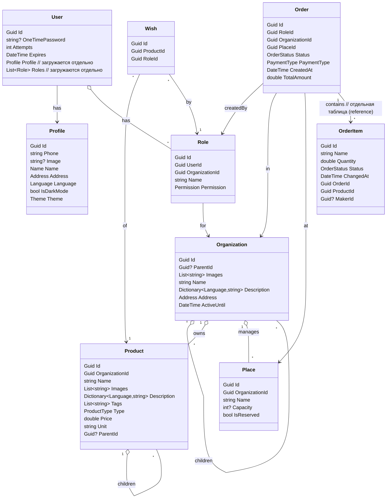

# 📝Software Requirements Specification (Спецификация требований программного обеспечения)

## 📋 Содержание
1. [📚 Введение](#1-введение)
2. [🏗️ Архитектура](#2-архитектура)
3. [📋 Функциональные требования](#3-функциональные-требования)
4. [📚 Нефункциональные требования](#4-нефункциональные-требования)
5. [📊 Диаграммы](#5-диаграммы)
   - [🏗️ Архитектура системы](#51-архитектура-системы)
   - [🔐 Процесс аутентификации](#52-процесс-аутентификации)
   - [👥 Модель ролей и прав доступа](#53-модель-ролей-и-прав-доступа)
   - [🛒 Процесс создания заказа](#54-процесс-создания-заказа)
   - [🏭 Развертывание инфраструктуры](#55-развертывание-инфраструктуры)
   - [📊 Бизнес-процессы](#56-бизнес-процессы)
   - [💾 Модель базы данных](#57-модель-базы-данных)
6. [🚀 Развертывание](#6-развертывание)
7. [📚 API Документация](#7-api-документация)
8. [🧪 Тестирование](#8-тестирование)
9. [🛠️ Сопровождение](#9-сопровождение)

---
## 1. 📚Введение 
### 1.1 🎯Назначение продукта 
Информационный продукт "Socratic" 🚀🌐 — универсальная омниканальная экосистема и AI-платформа для комплексной автоматизации бизнеса: розничной торговли, сферы услуг, электронной коммерции, развлечений (билетные системы, бронирование мест) и ресторанного бизнеса (HoReCa). Продукт обеспечивает эффективное управление заказами и продажами 📦, складскими запасами 🏭, персоналом 👥, финансами и рассрочками 💰, смарт-киосками самообслуживания 🖥️ и компьютерным зрением 🤖.

### 1.2 🚀Возможности продукта
- Единый универсальный каталог: товары, услуги, билеты, абонементы и места представлены как универсальные сущности `Product` (28 нативных UX-режимов) 🛍️🎟️🏢
- Управление заказами, бронированием мест, арендой и интерактивными схемами залов 🪑📍
- Складской учет и мониторинг остатков в реальном времени 📊
- Учет кадров, роли и разграничение доступа 👥
- Финансовый учет, прием платежей, рассрочки (Paying) и фискализация 💹💳
- Смарт-киоски самообслуживания (Kiosk POS) и сенсорные терминалы 🖥️
- Компьютерное зрение (YOLO), биометрия (Face ID) и видеоаналитика 👁️
- Векторный конструктор брендированных QR-кодов и 3D-визуализация 🎨

---
## 2. 🏗️Архитектура 

### 2.1 🛠️Технологический стек 
Продукт основан на следующих технологиях:
- gRPC/gRPC-Web на ASP.NET Core для межсервисного взаимодействия 🖥️
- Blazor Server + WebAssembly (гибрид) для веб-интерфейса 🌐
 - ScyllaDB (распределенная NoSQL СУБД) для хранения данных
- MinIO для объектного хранилища статических файлов и медиа 🗂️
 - Qdrant для векторного поиска (семантический поиск, RAG)
- Azure OpenAI/Azure AI (через подключение OPENAI-CONNECTION) для ИИ-функций 🤖
- .NET Aspire (AppHost) для оркестрации сервисов и инфраструктуры ⚙️
- Kestrel как веб-сервер; в прод-среде — за обратным прокси (например, Nginx/Ingress) 🌐

### 2.2 🧩Компоненты системы

#### 2.2.1 🌐Веб-приложение 
Реализовано с использованием Blazor. Предоставляет пользовательский интерфейс для взаимодействия с продуктом.

#### 2.2.2 🖥️Серверное взаимодействие 
Используется gRPC для обеспечения эффективного и масштабируемого взаимодействия между серверными компонентами.

#### 2.2.3 💾Хранилища данных и ИИ
- ScyllaDB — транзакционные данные (идентификация, каталог, заказы).
- MinIO — объектное хранилище для статических ассетов (изображения и т. п.).
- Qdrant — векторное хранилище для семантического поиска/интеллектуальных функций.

Примечание: в текущей реализации реляционная БД (PostgreSQL) и EF Core не используются.

---
## 3. 📋Функциональные требования 
### 3.1 📝Регистрация 
- 📞Ввод номер телефона 
- Ввод кода подтверждения (регистрация завершена с созданием пользователя с персональными данными по умолчанию и профилем по умолчанию).
- Ввод персонаных данных (опционально, после регистрации пользователь считается аутентифицированным и авторизованным).

### 3.2 🔒Аутентификация
- 📞Ввод номера телефона 
- 🔑Ввод кода подтверждения 

### 3.3 🛂Авторизация
Авторизация происходит после аутентификации и предоставляет доступ к функционалу продукта в зависимости от ролей и прав пользователя.

— Права роли «Customer» —

| Ресурс | 🆕 Create | 📖 Read | ✏️ Update | 🗑️ Delete |
|---|:---:|:---:|:---:|:---:|
| Role |  | ✅ |  |  |
| Profile |  | ✅ |  |  |
| Organization |  | ✅ |  |  |
| Product |  | ✅ |  |  |
| Place |  | ✅ |  |  |
| Order | ✅ | ✅ | ✅ | ✅ |
| OrderItem | ✅ | ✅ | ✅ | ✅ |

— Права роли «Director» —

| Ресурс | 🆕 Create | 📖 Read | ✏️ Update | 🗑️ Delete |
|---|:---:|:---:|:---:|:---:|
| Role | ✅ | ✅ | ✅ | ✅ |
| Profile | ✅ | ✅ | ✅ | ✅ |
| Organization |  | ✅ | ✅ |  |
| Product | ✅ | ✅ | ✅ | ✅ |
| Place | ✅ | ✅ | ✅ | ✅ |
| Order | ✅ | ✅ | ✅ | ✅ |
| OrderItem | ✅ | ✅ | ✅ | ✅ |

— Права роли «Owner» —

| Ресурс | 🆕 Create | 📖 Read | ✏️ Update | 🗑️ Delete |
|---|:---:|:---:|:---:|:---:|
| User | ✅ | ✅ | ✅ | ✅ |
| Role | ✅ | ✅ | ✅ | ✅ |
| Profile | ✅ | ✅ | ✅ | ✅ |
| Organization | ✅ | ✅ | ✅ | ✅ |
| Product | ✅ | ✅ | ✅ | ✅ |
| Place | ✅ | ✅ | ✅ | ✅ |
| Order | ✅ | ✅ | ✅ | ✅ |
| OrderItem | ✅ | ✅ | ✅ | ✅ |

— Пользовательская роль (шаблон) —

| Ресурс | 🆕 Create | 📖 Read | ✏️ Update | 🗑️ Delete |
|---|:---:|:---:|:---:|:---:|
| User |  |  |  |  |
| Role |  |  |  |  |
| Profile |  |  |  |  |
| Organization |  |  |  |  |
| Product |  |  |  |  |
| Place |  |  |  |  |
| Order |  |  |  |  |
| OrderItem |  |  |  |  |

---
## 4. 📚Нефункциональные требования 
### 4.1 🚀Производительность 
Ответы от сервера должны быть получены в течение 3 секунд ⏱️.

### 4.2 🛡️Безопасность 
Защита от атак, включая SQL-инъекции и межсайтовые атаки.

### 4.3 📈Масштабируемость 
Система должна легко масштабироваться для обработки увеличения нагрузки.

---
## 5. 📊Диаграммы 

### 5.1 🏗️Архитектура системы

Кратко:
- TLS завершается на NGINX Ingress Controller; браузер использует gRPC‑Web, внутри — HTTP/2.
- Все внешние вызовы к ИИ/SMS/Telegram идут из API; ключи не попадают в клиент.
- Статика раздаётся из MinIO.
- Здоровье/метрики включены через MapDefaultEndpoints; OTLP включается переменной OTEL_EXPORTER_OTLP_ENDPOINT.

### 5.2 🔐Процесс аутентификации

### 5.3 👥Модель ролей и прав доступа

Кратко:
- Permission — битовые флаги (enum [Flags]) на ресурсы/действия. "Customer", "Director" и "Owner" — преднастроенные маски флагов, а не отдельные сущности.
- Роль всегда привязана к Organization (мульти-организационный контекст доступа).
- JWT-клеймы включают UserId, OrganizationId, RoleId и Permission (long). Проверка прав выполняется по маске Permission.

### 5.4 🛒Процесс создания заказа

### 5.5 🏭Развертывание инфраструктуры

### 5.6 📊Бизнес-процессы

### 5.7 💾Модель данных (концептуальная, ScyllaDB)

> Примечание: В ScyllaDB данные распределены по таблицам. Идентификация сущностей осуществляется с помощью Guid. Связи реализованы через внешние ключи (id) в соответствующих таблицах. Данные денормализованы и оптимизированы для быстрого чтения по первичному ключу. Сложные типы (например, словари описаний в `Product`/`Organization` или вложенные объекты) хранятся в виде JSON-строк в текстовых колонках `payload` и десериализуются на стороне приложения.

> Примечание: Диаграммы созданы в Mermaid.js и могут быть интерактивными. Поддерживаются тёмная/светлая темы.

---
## 6. 🚀Развертывание
### 6.1 📋Требования к системе
- Ubuntu 22.04+ / Debian 11+
- Kubernetes кластер (например, Minikube, AKS, GKE) для прод-среды
- .NET 9 SDK
- Aspirate

### 6.2 📝Процесс развертывания
- Локально (разработка):
    - Проверьте/измените значения в `src/Frontend/AppHost/appsettings*.json` (URL сервисов, MINIO-URL и т. п.)
    - Запустите AppHost (оркестратор Aspire). Он поднимет ScyllaDB, MinIO, Qdrant и сервисы: `dotnet run --project src/Frontend/AppHost`
    - После старта AppHost выдаст адреса сервисов, включая UI.Web (переменная `WEB-UI-URL`)
- Прод/контейнеры:
    - Сборка контейнеров: `dotnet publish src/Frontend/AppHost -t:PublishContainer -c Release`
    - Публикация в реестр и деплой (в зависимости от окружения: Kubernetes, VM, App Service). Для Aspire-манифестов используйте `aspirate apply`

### 6.3 🔧Переменные окружения
Ключевые переменные (см. `src/Shared/Shared/ValueObjects/EnvironmentVariables.cs` и расширения `src/Frontend/AppHost/Extensions`):

| Переменная | Назначение |
|---|---|
| JWT-KEY | Секрет для подписи JWT |
| JWT-LIFETIME | Время жизни JWT (в минутах) |
| TELEGRAM-BOT-TOKEN | Токен бота для логирования/уведомлений (Identifying) |
| OPENAI-CONNECTION | Подключение к Azure OpenAI/Azure AI |
| SCYLLA-CONNECTION | Строка подключения к ScyllaDB |
| SCYLLA-NODES | Список адресов нод ScyllaDB (через запятую с портами) |
| SCYLLA-KEYSPACE | Имя пространства ключей (keyspace) ScyllaDB |
| SCYLLA-USERNAME | Имя пользователя для подключения к ScyllaDB |
| SCYLLA-PASSWORD | Пароль для подключения к ScyllaDB |
| QDRANT-CONNECTION | Строка подключения к Qdrant (включая ключ, если требуется) |
| MINIO-URL | Базовый URL MinIO для статики |
| MINIO-ROOT-USER | Пользователь MinIO (локально) |
| MINIO-ROOT-PASSWORD | Пароль MinIO (локально) |
| WEB-UI-URL | URL фронтенда |
| IDENTIFYING-SERVICE-URL | URL сервиса Identifying |
| SHOPPING-SERVICE-URL | URL сервиса Shopping |
| ORDERING-SERVICE-URL | URL сервиса Ordering |
| Kestrel__Endpoints__Http__Url | Прослушиваемый адрес (в прод для gRPC) |
| Kestrel__Endpoints__Http__Protocols | Протоколы (Http1AndHttp2 / Http2) |
| OTEL_EXPORTER_OTLP_ENDPOINT | Endpoint OTLP для экспорта трасс/метрик |

---
### 7. 📚API Документация
### 7.1 📝gRPC/gRPC-Web
Сервисы gRPC:
- Identifying (аутентификация/идентификация, разрешения)
- Shopping (каталог, остатки, операции с продуктами/местами)
- Ordering (создание/управление заказами; взаимодействует с Shopping)

Определения контрактов находятся в `src/Shared/Shared/Protos/`. Для браузера используется gRPC-Web (HTTP/1.1 ↔ прокси), backend слушает HTTP/2 (Kestrel). Авторизация через Bearer JWT.

### 7.2 🧩Blazor интеграция
В `UI.Web` и `UI.Web.Client` gRPC-клиенты настраиваются с добавлением заголовков:
- Authorization: Bearer {token}
- Accept-Language: {culture}

В браузере используется gRPC-Web. В прод-среде рекомендуется обратный прокси (NGINX Ingress Controller) с поддержкой HTTP/2 к backend. Параметры подключений (URL сервисов, MINIO-URL, QDRANT-CONNECTION, OPENAI-CONNECTION) прокидываются как переменные окружения.

---
## 8. 🧪Тестирование
- Модульные тесты
- Интеграционные тесты (gRPC-Web, БД)
- Системные тесты/сквозные сценарии

---
## 9. 🛠️Сопровождение
- Инструкции по обновлению: update_instructions.md
- Техподдержка: через систему обращений (см. сайт поддержки)

---
## 🎉Заключение
Документация описывает продукт "Socratic" и процессы разработки/развертывания/тестирования в соответствии с практиками .NET 9 и .NET Aspire, обеспечивая прозрачность и воспроизводимость.
