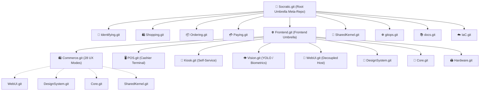

# Socratic Federated Meta-Repository & Git Submodules Workflow

## 1. 🏛️ Architectural Pattern: Federated Meta-Repository & Stream-Aligned Teams

Socratic uses the **Federated Meta-Repository Pattern** (also known as *Umbrella Repository* with *Stream-Aligned Teams* from Team Topologies and *Self-Contained Systems (SCS)*).

### Key Architectural Tenet:
> **Maximum Team Autonomy with Unified Ecosystem Orchestration:**
> A new engineer joining a stream-aligned team (e.g., Commerce, POS, Kiosk, or Vision) does **NOT** clone the massive monorepo. They clone **only their feature repository** (`git clone --recurse-submodules https://github.com/socratic-uz/<Feature>.git`) and immediately get a fully functional, self-contained development environment with its own submodules, host, and launch profiles.
> Simultaneously, the root `Socratic` meta-repository orchestrates all microservices, frontend features, and infrastructure as a unified whole.

---

## 2. 🗺️ Multi-Tier Repository Topology



### Complete Submodule Registry:

| Tier | Submodule Path (Root Meta-Repo) | Remote Repository | Domain / Ownership |
|---|---|---|---|
| **Root** | `src/Frontend` | `https://github.com/socratic-uz/Frontend.git` | Frontend Umbrella Meta-Repo |
| **Feature** | `src/Frontend/Features/Commerce` | `https://github.com/socratic-uz/Commerce.git` | Stream: 28 Universal Product UX Modes |
| **Feature** | `src/Frontend/Features/POS` | `https://github.com/socratic-uz/POS.git` | Stream: Cashier & POS Terminal |
| **Feature** | `src/Frontend/Features/Kiosk` | `https://github.com/socratic-uz/Kiosk.git` | Stream: Self-Service Kiosks |
| **Feature** | `src/Frontend/Features/Vision` | `https://github.com/socratic-uz/Vision.git` | Stream: YOLOv10 & Computer Vision |
| **Platform** | `src/Frontend/Apps/Web.UI` | `https://github.com/socratic-uz/WebUI.git` | Decoupled Blazor Host (Server + Client) |
| **Platform** | `src/Frontend/DesignSystem` | `https://github.com/socratic-uz/DesignSystem.git` | Material Web 3, Tokens, Theme |
| **Platform** | `src/Frontend/Core` | `https://github.com/socratic-uz/Core.git` | Primitives, Base Components |
| **Platform** | `src/Frontend/Core/Hardware` | `https://github.com/socratic-uz/Hardware.git` | ESC/POS, Scales, Barcode Scanners |
| **Shared** | `src/Shared/SharedKernel` | `https://github.com/socratic-uz/SharedKernel.git` | gRPC Protos, ValueObjects, DTOs |
| **Backend** | `src/Backend/Identifying` | `https://github.com/socratic-uz/Identifying.git` | Auth, Identity, FaceID, SMS |
| **Backend** | `src/Backend/Shopping` | `https://github.com/socratic-uz/Shopping.git` | Catalog, Products, Places, ScyllaDB |
| **Backend** | `src/Backend/Ordering` | `https://github.com/socratic-uz/Ordering.git` | Orders, State Machine, ScyllaDB |
| **Backend** | `src/Backend/Paying` | `https://github.com/socratic-uz/Paying.git` | Payme, Ledger, Installments, Scoring |
| **DevOps** | `gitops` | `https://github.com/socratic-uz/gitops.git` | Kubernetes manifests, Helm charts |
| **Docs** | `docs` | `https://github.com/socratic-uz/docs.git` | Architecture documentation |
| **Infra** | `scripts/IaC` | `https://github.com/socratic-uz/IaC.git` | Infrastructure as Code |

---

## 3. ⚙️ Standard Build Configurations (Strict Standard)

All `.csproj` files, `Directory.Build.props`, and `.slnx` solution files in the entire ecosystem must define exactly the **5 standardized configurations**:

```xml
<Configurations>Debug;Release;LocalDebug;Runner;Cluster</Configurations>
```

| Configuration | Intent / Target Environment | Optimization & Constants |
|---|---|---|
| `Debug` | Standard local development with full debug symbols and local services | Optimization off, `DEBUG;TRACE` |
| `Release` | Production build optimized for deployment, AOT and trimming | Optimization on, symbols stripped |
| `LocalDebug` | Local debugging against standalone mock backend or local containers | Custom local endpoints, mock auth |
| `Runner` | CI/CD test runners, automated smoke tests and benchmark executions | Deterministic build, headless mode |
| `Cluster` | Containerized in-cluster deployment (Kubernetes / Aspire Service Discovery) | OTLP telemetry enabled, DNS resolution |

---

## 4. 🧠 Smart Multi-Level Build System

Every standalone feature repository (`Commerce.git`, `POS.git`, `Kiosk.git`, `Vision.git`) operates under a **Dual-Mode Discovery Pattern**:

1. **Standalone Mode** (Feature Developer):
   - Developer clones: `git clone --recurse-submodules https://github.com/socratic-uz/Commerce.git`
   - `Directory.Build.props` in the feature root checks:
     ```xml
     <Import Project="$([MSBuild]::GetPathOfFileAbove('Directory.Build.props', '$(MSBuildProjectDirectory)/..'))"
             Condition="'$(_SocraticRootProps)' == '' and Exists('$([MSBuild]::GetPathOfFileAbove(...))')" />
     ```
   - If parent props do not exist, local fallback properties and packages from local `Directory.Packages.props` take effect.
   - Solution uses the local standalone host (`src/Platform/Web.UI` or `src/Host/Web.UI`) to run the feature in total isolation.

2. **Monorepo Mode** (Orchestration Developer / Architect):
   - Developer opens `Socratic.slnx` or `src/Frontend/Frontend.slnx`.
   - Root `Directory.Build.props` sets `<_SocraticRootProps>true</_SocraticRootProps>`.
   - Sub-features inherit root packages, centralized analyzers, and Aspire orchestration.

---

## 5. 🚀 Developer Workflows & Submodule Initialization

### ⚠️ Критическое правило: Запрет вложенных субмодулей в мета-репозитории (Zero Nested Duplication)
Внутри мета-репозитория `Socratic` все общие зависимости уже развернуты на верхних уровнях:
- `src/Shared/SharedKernel` — общие gRPC контракты, Protobuf и DTO.
- `src/Frontend/Core/*` — Domain, Infrastructure, Shared.
- `src/Frontend/DesignSystem/*` — Material.Web, Smart.Web, QuickGrid, Markdown.
- `src/Frontend/Hardware/*` — Принтеры чеков, сканеры, биометрия.
- `src/Frontend/Apps/Web.UI` — Универсальный хост Blazor.

> [!CAUTION]
> **Субмодулям фич (`Commerce`, `POS`, `Kiosk`, `Vision`) и микросервисов (`Identifying`, `Ordering`, `Paying`, `Shopping`) категорически запрещено инициализировать свои собственные субмодули внутри мета-репозитория!**
> Если их субмодули будут загружены, возникнет массивное дублирование кода, конфликты типов в компиляторе Roslyn, замедление сборки и раздувание Git.
> Их собственные субмодули нужны **ТОЛЬКО** при автономном клонировании конкретной фичи вне мета-репозитория.

### Scenario A: Stream-Aligned Feature Developer (Standalone Mode, e.g. Commerce)
Разработчик работает только над одной фичей вне мета-репозитория:
```bash
# 1. Клонирование с рекурсивными субмодулями (нужны все локальные платформенные сабмодули)
git clone --recurse-submodules https://github.com/socratic-uz/Commerce.git
cd Commerce

# 2. Сборка и запуск локального решения:
dotnet build Commerce.slnx -c Debug
dotnet run --project Web.UI/Web.UI/Web.UI.csproj -c Debug
```

### Scenario B: Monorepo Umbrella Developer (Мета-репозиторий Socratic)
Разработчик работает в монорепозитории. Загружаются только субмодули 1-го и 2-го уровней:
```bash
# 1. Клонирование мета-репозитория (БЕЗ флага --recurse-submodules!)
git clone https://github.com/socratic-uz/Socratic.git
cd Socratic

# 2. Инициализация только 1-го уровня (бэкенд, фронтенд, SharedKernel):
git submodule update --init

# 3. Инициализация 2-го уровня (Apps/Web.UI и фичи внутри src/Frontend):
git -C src/Frontend submodule update --init

# 4. Сборка решения:
dotnet build Socratic.slnx -c Debug
```

### 🧹 Команда очистки / деинициализации вложенных субмодулей
Если разработчик или скрипт случайно инициализировал вложенные субмодули внутри фич/сервисов:
```bash
# Деинициализировать вложенные субмодули фич:
git -C src/Frontend/Features/Commerce submodule deinit --all -f
git -C src/Frontend/Features/POS submodule deinit --all -f
git -C src/Frontend/Features/Kiosk submodule deinit --all -f
git -C src/Frontend/Features/Vision submodule deinit --all -f

# Деинициализировать вложенные субмодули бэкенда:
git -C src/Backend/Identifying submodule deinit --all -f
git -C src/Backend/Ordering submodule deinit --all -f
git -C src/Backend/Paying submodule deinit --all -f
git -C src/Backend/Shopping submodule deinit --all -f
```

---

## 6. 🌳 Multi-Tier Git Commit Workflow

> [!IMPORTANT]
> **DO NOT automatically commit or push to Git** without explicit user instruction.
> When instructed to commit, always commit in **bottom-up order** through the hierarchy.

### Commit Sequence (Bottom-Up):
1. **Tier 1 (Innermost Platform Submodules)**:
   If changes were made to `Hardware`, `DesignSystem`, `Core`, or `WebUI`:
   ```bash
   git -C <submodule_path> add .
   git -C <submodule_path> commit -m "<type>(<scope>): <message>"
   git -C <submodule_path> push origin HEAD
   ```

2. **Tier 2 (Stream-Aligned Feature Repositories)**:
   Commit the updated platform pointers and feature code:
   ```bash
   git -C src/Frontend/Features/Commerce add .
   git -C src/Frontend/Features/Commerce commit -m "feat(commerce): <message>"
   git -C src/Frontend/Features/Commerce push origin HEAD
   ```

3. **Tier 3 (Frontend Umbrella Meta-Repo)**:
   Commit the updated feature pointers in `src/Frontend`:
   ```bash
   git -C src/Frontend add .
   git -C src/Frontend commit -m "chore(features): update feature pointers"
   git -C src/Frontend push origin HEAD
   ```

4. **Tier 4 (Root Umbrella Meta-Repo)**:
   Commit the updated `src/Frontend` and backend submodule pointers in root:
   ```bash
   git add src/Frontend src/Backend/*
   git commit -m "chore(ecosystem): synchronize submodule pointers"
   git push origin HEAD
   ```

---

## 7. 🔄 Submodule Synchronization Commands

- **Обновить субмодули верхнего уровня**:
  ```bash
  git submodule update --remote --merge
  git -C src/Frontend submodule update --remote --merge
  ```
- **Проверить статус только активных субмодулей**:
  ```bash
  git submodule foreach --recursive "git status -s"
  ```


